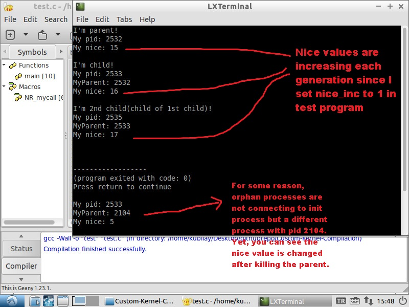

# Custom-Kernel-Compilation
In this assignment, we are asked to slightly alter the functions of fork and exit system calls, where nice value of the spawned process will be adjusted based on the nice value of the parent process and the nice_increment value, which will be stored in a field in the task descriptor of the parent process.

